## Basics of Computer Science and Software Engineering Job?

---

## Introduction

This is Rajasekar Elango, Software Engineer at Salesforce.com

---

@title[About Audience]

What are you curious to know about computer science?

Note: I encourage you to ask question whenever you have. Please don't hesitage.

---
## Are computers smart?
@title[Computers are stupid]

Computers are really **stupid**. But it is very *fast*. 

Humans are **smart**, but *slow*. 

Computers can **tirelessly** do repetitive tasks whereas humans will get *exhausted* . 

---
@title[Binary Introduction]

Infact, the hardware inside the computer doesn't know anything other than 0’s and 1’s.

---
@title[Everything is stored as binary]

All the videos, music and textual information you see in computers are stored as just **0’s** and **1’s.**

---

## Why the digital world has only 0 & 1?
@title[Why digital world has only 0 and 1?]

All the hardware is made from wonderful semiconductor material ***silicon***. 

 It can easily change state between stop conducting ( **0** ) and start conducting ( **1** ) electricity through them. 

Silicon is used to make a tiny device called ***transistor*** which stores one bit of 0 or 1 - refered as ***binary***. 

Note: Discuss about conductors and insulators.

---

## What's inside Computers?

> Computers are made of billions of tiny ***transistors*** which can be programmed to flip states between 0 and 1 using electrical signals.

---
@title[Human brain and Computers]

Just like billions of neurons fire in our Human brain based on visual, auditory or sensory signal.

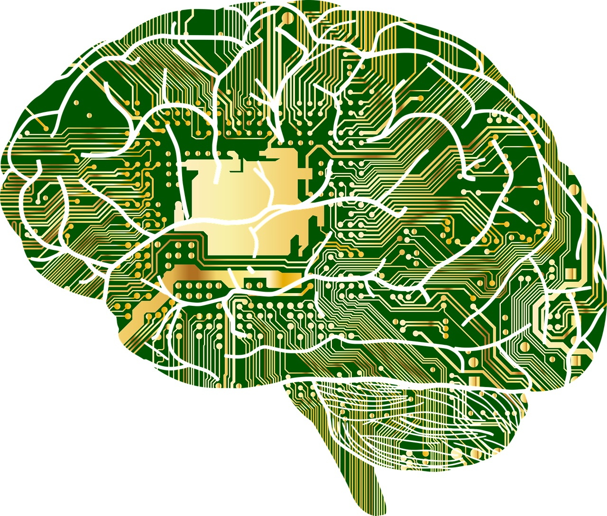

---

## Why computers is a genius invention? 

- It will be super expensive, if we had to build a new computer for every different thing we want to do. 

- Instead, we invented a general purpose computer containing a assembly of transistors that can do different things, depending on which transistors are swiched on and off.  

Note: For eg. We don't need a separate device to play each game. We can play several games in a single computer or a phone.

---

## Quiz: Say True or False

1. Computers can understand only english  - False. 

2. Computers could do anything from adding two numbers to flying an airplane.  - True. 

---

## What is a Computer?

> `Computer is a electronic machine that can be programmed to do zillions of different tasks.`

---
@title[Components of A Computer CPU]
### Components of A Computer CPU

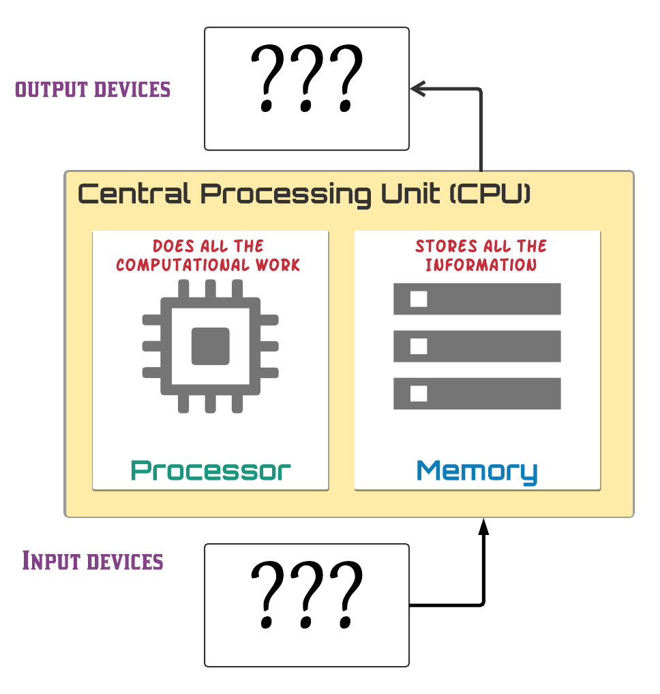

Can you tell some Input and Output devices?

---

### Components of A Computer with Input and Output

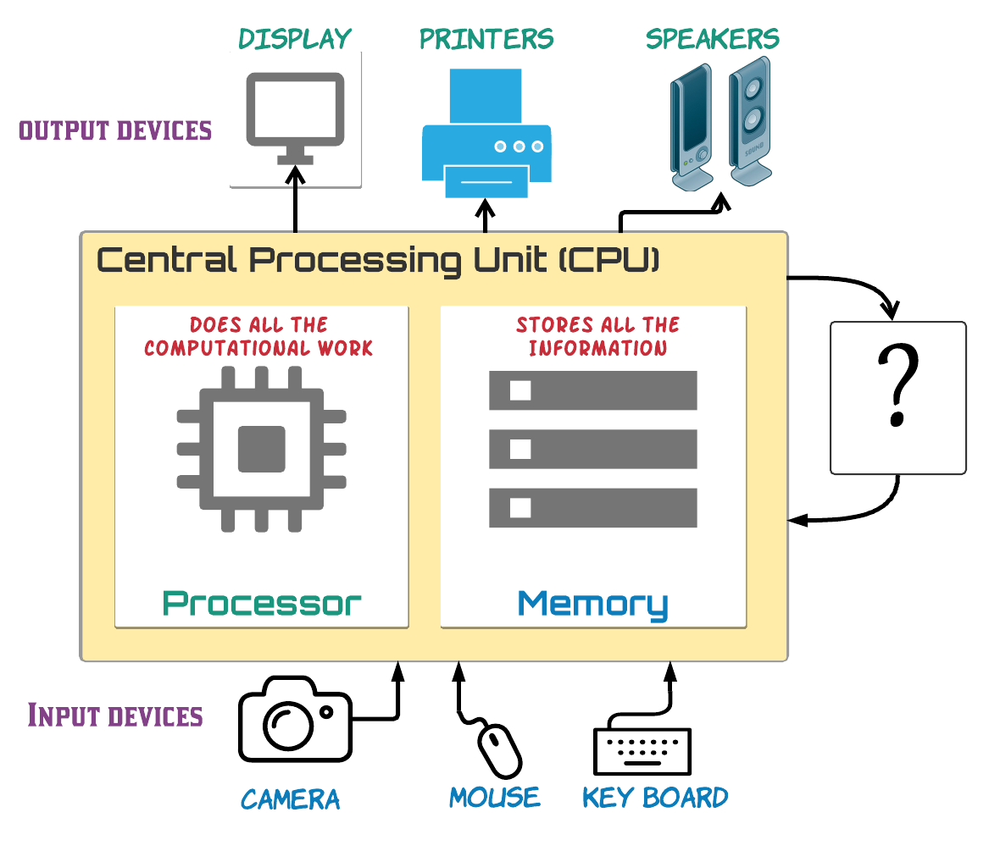

Can same device be used for both Input and Output?
---

### Components of A Computer

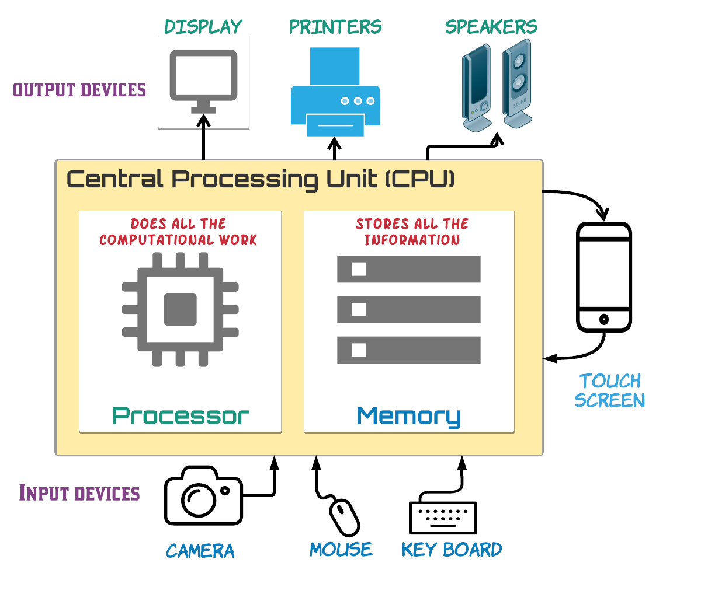

That's why touch screen devices are very easy use.

---

#### How many of you know what does GB or MB mean in phone or computers?
@title[What does GB Mean?]

 Bytes or Gigabytes is unit for measuring memory just like pounds for weight, ounces for liquid etc. 

<table class="fragment"> 
	<tr>
		<td>1 Bit </td>
		<td>= Binary Digit 0 or 1 </td>
	</tr>
	<tr>
		<td>8 Bits </td>
		<td>= 1 Byte </td>
	</tr>
	<tr>
		<td>1024 Bytes </td>
		<td>= 1 Kilobyte (KB) </td>
	</tr>
	<tr>
		<td>1024 Kilobytes</td>
		<td>= 1 Megabyte (MB) </td>
	</tr>
	<tr>
		<td>1024 Megabytes</td>
		<td>= 1 Gigabyte (GB) </td>
	</tr>
</table>

---

## Quiz: Say True or False

Computers can do everything by itself - False. 

---

## How do you tell Computers to do something?

---
@title[What are Algorithms?]

We need to provide a sequence of instructions telling a computer to what to do which is called as ***Algorithms***.

---

### Algorithm example

Algorithm to tell if temperature is Below or Above the Freezing Point

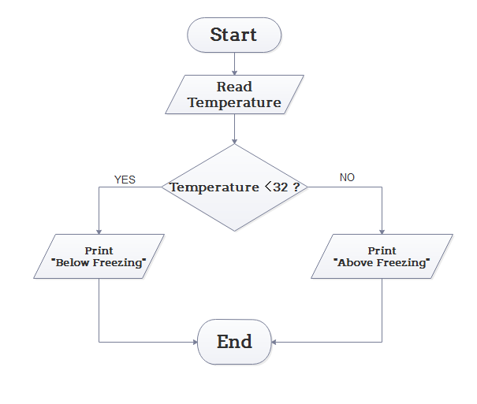

---

### How transistors execute Algorithms?

Transistors are combined to create ***logic gates*** that can perform logical operations like ***AND***, ***OR***, ***NOT***

Every algorithm, no matter how complex, can be reduced to just these three operations: AND, OR, and NOT.

---

### Algorithm logic gates example

if a fever can be caused by influenza or malaria, and you should take Tylenol for a fever and a headache

---

### Algorithms can solve complex problems

Algorithms can be combined together to solve complex problems.

Just like simple mathematical operations are combined to produce complex mathematical formulas.

Algorithms fly the airplanes, forecast weather, play games, tell us driving directions and so on.

---
### Quiz: Match Profession to Work

<table>
	<tr>
		<td>Scientists</td>
		<td>Make algorithms that connects both theories and devices</td>
	</tr>
	<tr>
		<td>Engineers</td>
		<td>Make theories</td>
	</tr>
	<tr>
		<td>Computer scientists</td>
		<td>Make devices</td>
	</tr>
</table>

---

### Answers: Match Profession to Work
<table>
	<tr>
		<td>Scientists</td>
		<td>Make theories.</td>
	</tr>
	<tr>
		<td>Engineers</td>
		<td>Make devices.</td>
	</tr>
	<tr>
		<td>Computer scientists</td>
		<td>Make algorithms that connects both theories and devices.</td>
	</tr>
</table>
---
## What is Programming?

@title[What is Programming?]

> `Programming is the act of taking complicated human ideas and breaking them down into simple algorithms that computers can understand and follow.`

A Programmer creates algorithms and codes them up in human friendly language like `Java` or `Python`

---
## What is Software?
@title[What is Software?]

> Software is collection of programs that are written in language humans can understand and then they are converted into binary that computers can execute them.

---

## Software diagram

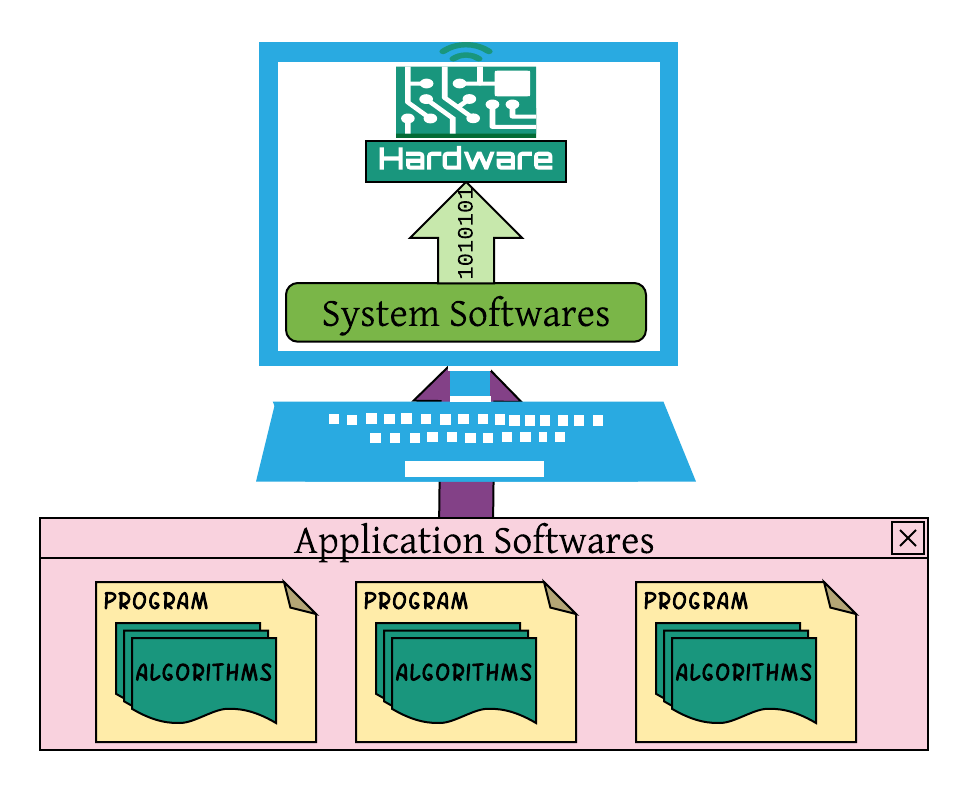

---

## Software run every device
Softwares run computers, smart phones, XBox, Billing machines.

---

## Quiz: Say True or False

Without Software the hardware devices would be idle.  - True. 

---

## Why Software industry is at rise today?

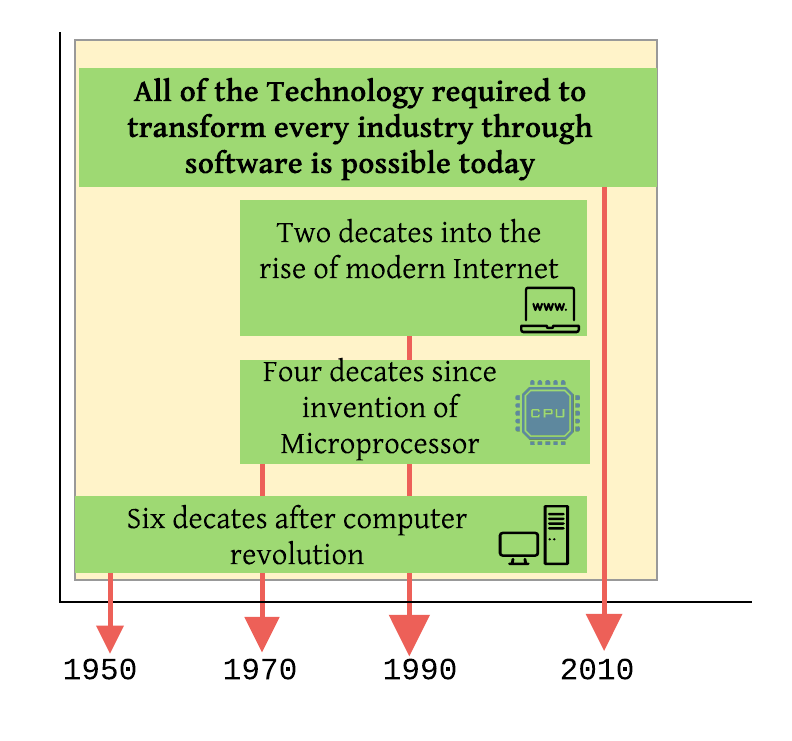

---

### Every Industry is revolutioned by Software

<table>
	<tr>
		<td>Industry</td>
		<td> Examples </td>
	<tr>
	<tr>
		<td>Movies</td>
		<td class="fragment"> Animation, Netfix </td>
	<tr>
	<tr>
		<td>Games</td>
		<td class="fragment"> XBOX, Mobile Games </td>
	<tr>
	<tr>
		<td>Retail</td>
		<td class="fragment"> Amazon, Online shopping </td>
	<tr>
	<tr>
		<td>Finance</td>
		<td class="fragment"> Stock market, Paypal </td>
	<tr>
	<tr>
		<td>Education</td>
		<td class="fragment"> Youtube, Khanacademy, Udemy </td>
	<tr>
</table>

Note: The best new movie production company in many decades, Pixar, was a software company. Disney — had to buy Pixar, a software company, to remain relevant in animated movies.

---

## Quiz: Say True or False

If you learn programming, you can apply the skills in any domain you choose. - True

---

## Why being a Software developer is Great?

---

### Drives creativity and innovation

* It's very creative profession as much like a musician or a painter.

* Programming is fundamentally about creating  solutions to problems. 

---

### Make people's life better

You will solve problems to make people's life better.

---

### Impact millions of people quickly

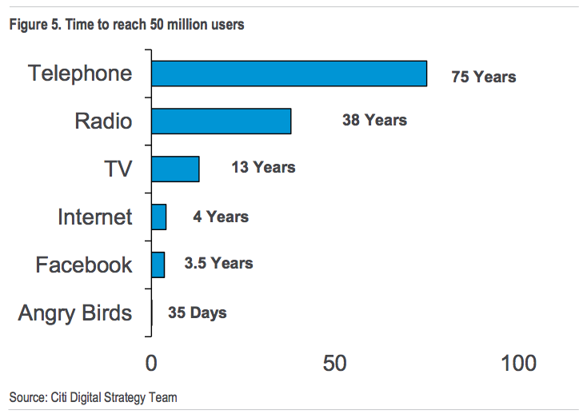

Telephone took 75 years, Internet took 4 years however Angry Birds took only 35 days!! to reach 50 Million users.

---

### Colloborative 

Software engineering is a team sport and you work together to build amazing things.

---

### Future Proof

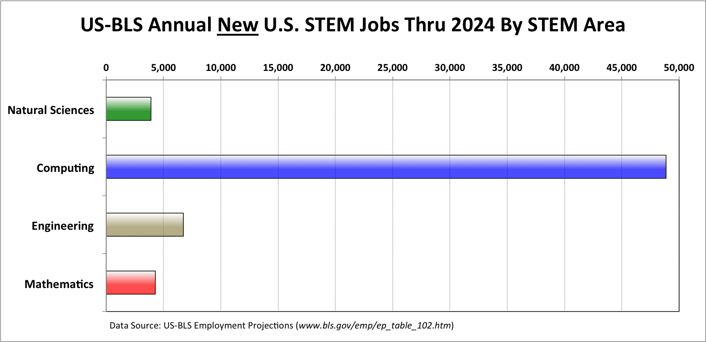

As per US-BLS projections, computing will be the safest STEM career options for the foreseeable future.

---

### Pays well

* Because of high demand, Software engineers are paid well.

* Software engineers can create lot of value with no cost of raw materials.

* All you need is your time and a computer.

---

### Work from anywhere.

With the internet, you can literally work from any where in the world.

---

#### Quiz:  which one of these a Software Engineer doesn't do?

* Makes people's life better.
* Solves complex problems.
* Sells computers to customers.
* Works together in a team.

---

#### Answer: which one of these a Software Engineer doesn't do?

* Makes people's life better.
* Solves complex problems.
* ~~Sells computers to customers.~~
* Works together in a team.

---
## What traits should I have to become Software engineer?

---
### Love making things for other people to use

* At end of the day, you have created something that didn't exist that morning.
* You feel happy when people use the product you created.

---

### Enjoy solving puzzles

You are passionate about solving complex problems

---

### Like Experimenting and Research

* You like doing experiments, you will try something, if it doesn't work scratch that off and try different approach.
* You also like doing research, you search the web, read the documentation, refer the books to come up with a solution.

---

### You want to make things easier in life.

Microsoft's founder Bill Gates said he would always  *"hire a lazy person to do a difficult job"*

Because **A lazy person will find an easy way to do it**.

---

### You have interest in both Arts and Engineering.

* Software engineering utilizes right mix of both Artistic and Engineering skills.
* Writing a program is an art like writing a poem at the same time it needs applying logical skills to solve the problem.

---
@title[Intersection of Arts and Technology]
According to Steve Jobs -- The greatest innovations come from the intersection of technology and arts.

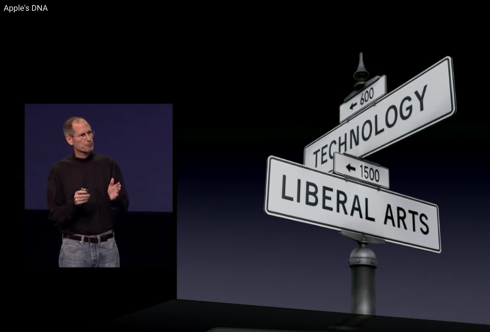

---

### You are a Curious learner

* You need to continously learn new things and keep up ever changing technology.

---

### Quiz : Say True or False

A Software engineer can stop learning after college.  - False

Learning Arts will help in Software engineering job.  - True

---

### What's fascinating about Computers today?

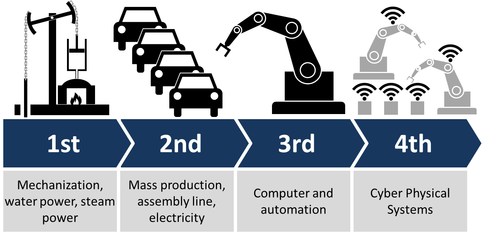

We are heading towards making machines to learn and creating artificial intelligent systems.

---

### What is Machine learning?

* Machine learning makes computers to learn skills that humans can't explain.

* It figures out Algorithm by analysing large set of sample data.

* With machine learning, computers write their own programs, so we don’t have to.

---

#### Difference between Traditional Programming and Machine Learning

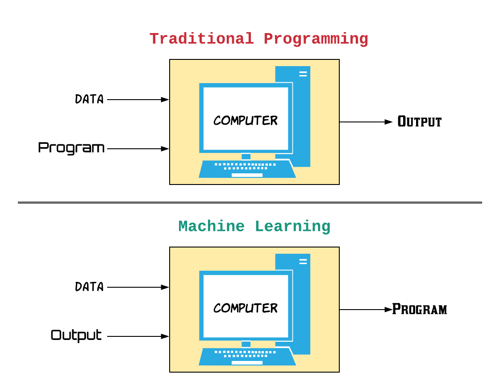

We can think of machine learning as inverse of programming just like Square root is inverse of Square.

---

### Quiz: Say True or False

Can Computer learn human skills?  - True 

---

### Applications of Machine learning

- [AutoDraw](https://www.autodraw.com/) uses the magic of machine learning with drawings from talented artists to help everyone create anything visual, fast.

- Computers have learned to recognize our face, our voice, handwriting , etc.

---
### Robots are becoming our assistants

iRobot vaccum can find it's way through your home and clean.

---

@title[Robots can answer our questions]

Siri , Alexa, Google Now are able to answer our questions just like humans.

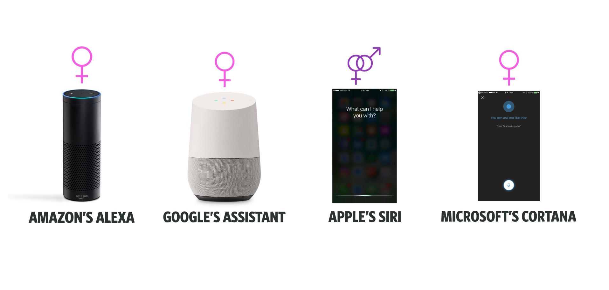

---

### Computers beat world Chess champion.

IBM's Chess computer Deep Blue beat world Chess Champion Garry Kasparov in 1997.

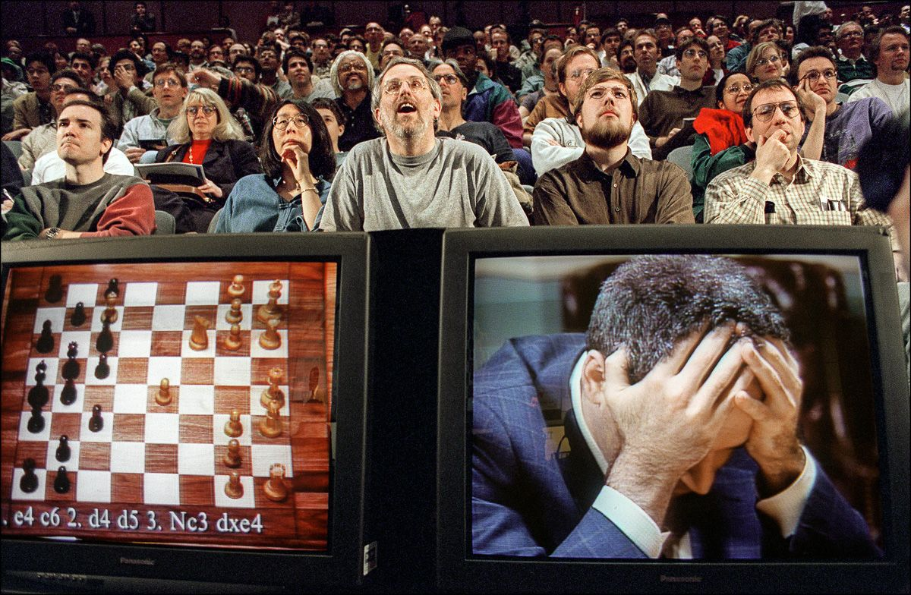

--- 

### AlphaGo beats world Go champion Lee Sedol 

Go is very complex game compared to Chess, it won't be possible without machine learning.

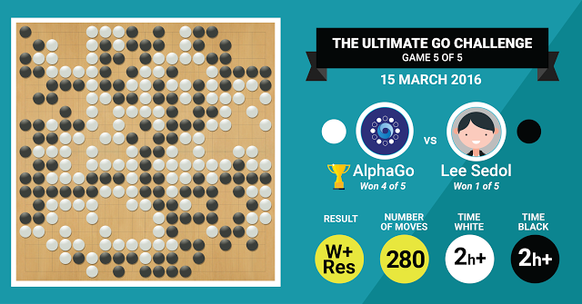

---

### The supercomputer IBM Watson

Watson won the first prize against former winners Brad Rutter and Ken Jennings in Jeopardy TV contest.
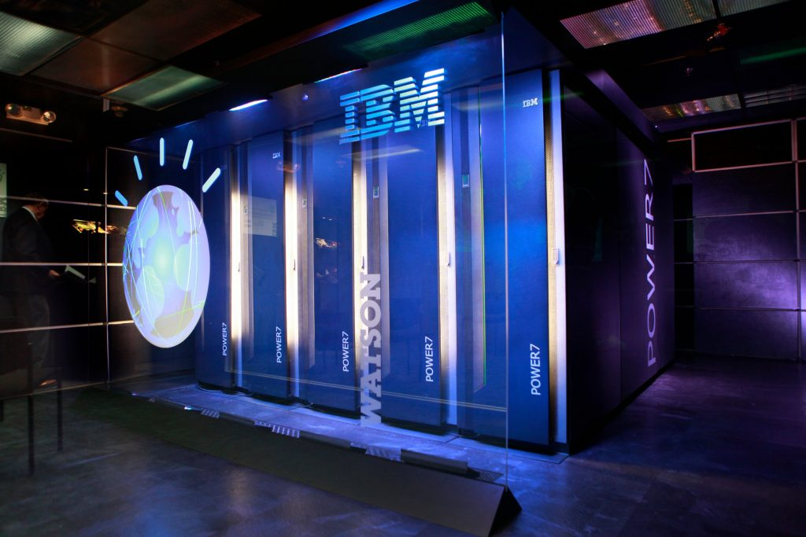

---
@title[Power of IBM Watson]

* Watson can understand human's natural language and answer questions.
* Watson has got all the knowledge of encyclopedias, dictionaries, newswire articles, and literary works.
* Watson can process about million books, per second.

---

### How will future look like?

* Self driving cars will become common on the road.
* Bots will become part of our daily life.
* All devices around us will be a smart device like smart phones.
* You will be helped by Chat Bots and Virtual assitants on the internet.
* We will able to cure deadly diseases like Cancer using Machine learning.

---

## How many of you are interested in Programming?

---

## How to Get Started on learning to Program?

* https://code.org/ — The most well known and popular project that teaches kids to code.
* http://lightbot.com/ — This mobile game starts really easy and adds more and more complex concepts over time eventually getting quite challenging. 
* https://www.codingame.com/start — is aimed at more experienced and older kids, teaching more complex techniques

---
@title[Learn programming resources]

* https://www.allcancode.com/home — Uses visual programming language to learn how to code and build amazing apps
* http://scratch.mit.edu/ You can program your own interactive stories, games, and animations.
* [Lego mind storms](http://www.lego.com/en-us/mindstorms/?domainredir=mindstorms.lego.com) -- build programmable robots based on Lego building blocks.

---
@title[Learn programming resources continued]

* https://www.khanacademy.org/  — Build apps using Javascript guided by video tutorials.
* [Python-Kids-Playful-Introduction-Programming](http://www.amazon.com/Python-Kids-Playful-Introduction-Programming/dp/1593274076)
* [Hello World!: Computer Programming for Kids and Other Beginners](http://amzn.com/1617290920)

---

## Credits

[Five Reasons why software engineering is a great career choice.](https://henrikwarne.com/2014/12/08/5-reasons-why-software-developer-is-a-great-career-choice/amp/)

[Why Software is Eating World](https://a16z.com/2016/08/20/why-software-is-eating-the-world/)

[The market for computing careers](https://cs.calvin.edu/documents/computing_careers)

[To reach 50 Million users Angry bird took only 35 days](https://www.techworm.net/2015/03/to-reach-50-million-users-telephone-took-75-years-internet-took-4-years-angry-birds-took-only-35-days.html/amp)

[The Master Algorithm: How the Quest for the Ultimate Learning Machine will Remake our world](http://amzn.to/2DtRt47)